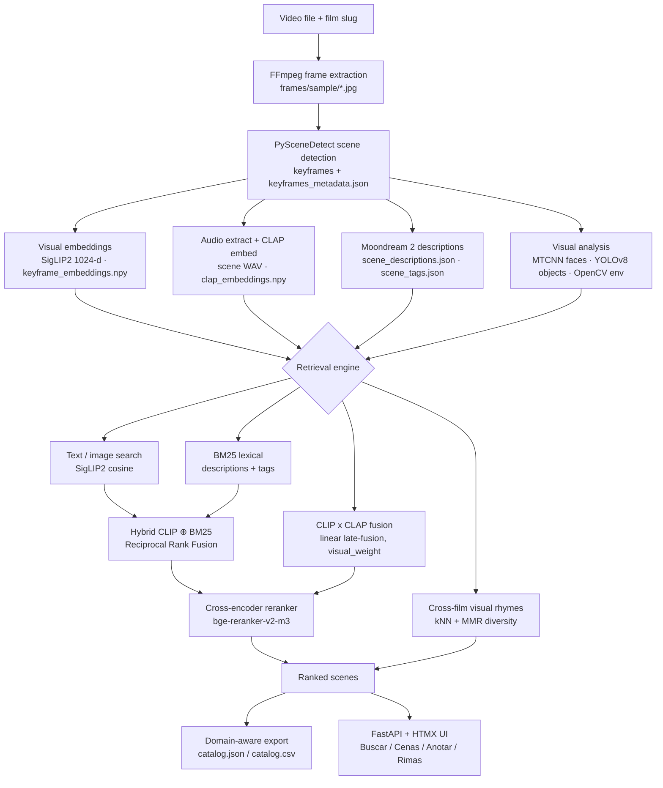

# Cinemateca imgsearch

**Offline multimodal search and metadata generation for archival video collections.**

Cinemateca imgsearch is a local-first applied AI workbench that turns video files
into searchable, human-reviewable scene catalogs. The first domain is film
archive cataloging: historical footage, sparse metadata, unusual aspect ratios,
and digitized material with variable quality.

Portuguese context: sistema de catalogação audiovisual com modelos locais para
cinematecas nacionais e arquivos públicos de filme.

[](https://github.com/guto-mojica/cinemateca-imgsearch/actions/workflows/ci.yml)
<!-- If the GitHub owner/repo slug changes, update the CI badge URL above. -->
[](LICENSE)
[](https://python.org)
[](CHANGELOG.md)

---

## Overview (English)

**Offline multimodal retrieval for film archives.** Search hours of
audiovisual material by what's on screen and what's *heard* — without sending
a frame to the cloud. After installation and model downloads, processing and
search run locally, with no video, keyframes, annotations, embeddings, or
search queries sent to hosted AI APIs.

### What it does

The headline capability is a layered multimodal retrieval stack. Every model
runs **locally** on a single workstation — no API keys, no cloud calls, no
per-query cost.

- **Text and image search** over SigLIP2 image embeddings
  (`google/siglip2-large-patch16-256`, 1024-d, multilingual). The legacy
  OpenCLIP ViT-B/32 backend is still selectable for backward compatibility,
  but SigLIP2 is the default.
- **Hybrid lexical retrieval** — BM25 over LLM descriptions + tags, fused with
  the dense scores via Reciprocal Rank Fusion. This is the default retriever.
- **Audio search** over CLAP joint text+audio embeddings
  (`laion/larger_clap_general`) — query "footsteps on wood" and get the scenes
  that *sound* like it. 10-second chunks, mean-pooled, L2-normalised; served
  via `?modality=audio` on `/api/search`.
- **Cross-modal fusion** — `quiet scene with melancholic music` combines CLIP
  and CLAP scores with linear late-fusion under one `visual_weight` knob
  (default 0.5). Lives at `?modality=fusion&w=0.5` on `/api/search`.
- **Cross-film visual rhymes** — kNN over keyframe embeddings, diversified by
  **MMR** (Carbonell & Goldstein 1998) with a λ=0.5 default and a `Diversidade`
  slider in the UI.
- **Cross-encoder reranker** — `BAAI/bge-reranker-v2-m3` is the typed, wired
  default backend. It is **off by default** pending end-to-end plumbing into
  the production search dispatchers (the WS-4 work); the launch UI hides the
  toggle until that lands. It is not applied to results today.

The full canonical stack:

| Role | Backend |
|---|---|
| Image embedder | `google/siglip2-large-patch16-256` (default), OpenCLIP ViT-B/32 (legacy) |
| Audio embedder | `laion/larger_clap_general` (10s chunks + mean-pool) |
| Reranker | `BAAI/bge-reranker-v2-m3` (typed/wired; default-off pending WS-4) |
| Scene describer | Moondream2 (HF transformers default; GGUF opt-in) |
| Object detection | YOLOv8 |
| Face detection | MTCNN |

Retrieval metrics — Recall@K / MRR / nDCG@10 — land with the WS-4 ablation;
see [`docs/EVAL_PROTOCOL.md`](docs/EVAL_PROTOCOL.md). A CLAP archival-audio
sanity gate currently pins Recall@5 ≥ 0.6 over five canned queries on the Jeca
Tatu library (`cinemateca eval clap-sanity`).

### What it doesn't do

- **Stream over the public internet.** You can deploy it behind a reverse
  proxy, but the project is built for institutional intranets.
- **Replace the catalogue of record.** Cinemateca imgsearch sits *next to* the
  existing catalogue and feeds curators retrieval candidates; authoritative
  metadata still lives in the institution's system.
- **Learn fusion weights from data.** Fusion stays at one tunable knob
  (`visual_weight`); learned weights are explicitly out of scope for v1.0.

### Also includes (production signals)

Beyond retrieval, the pipeline produces the catalogue substrate and the
operational scaffolding a real archive needs:

- **Scene segmentation** — detects cuts and extracts a representative keyframe per scene.
- **Visual analysis** — detects faces, objects, and classifies environment (indoor/outdoor, day/night).
- **Natural language descriptions** — a local vision model (Moondream 2) describes each scene in text.
- **Manual annotation** — a dedicated tab lets curators add or correct tags scene by scene, merged with automated metadata for search.
- **Domain packs** — archive-first, with `media_broadcast` as a worked example of swapping prompts and export shape for an adjacent private visual-search workflow.
- **Domain-aware exports** — structured JSON/CSV catalog exports.
- **Run manifests** — every pipeline run writes `run_manifest.json` with input, config, model, domain, step, and artifact provenance.
- **Admin-gated evaluation UI** — query grading with JSONL grade persistence.

### Who this is for

- **Archivists and curators** who need a searchable first pass over digitized film collections.
- **Researchers** who need to find visual moments inside long-form footage.
- **Applied AI reviewers** who want to inspect a realistic local multimodal system rather than a hosted API demo.

### Current status

Implemented now (engineering maturity, beyond the capabilities above):

- Single-machine video processing pipeline behind a FastAPI + HTMX web interface.
- Multi-film library registry with per-film artifact layout and scene-browsing UI.
- Configurable local model backends behind typed Protocols.
- Reproducible public-demo scaffold using Library of Congress footage.
- Retrieval evaluation runner with JSON/Markdown reports.
- Command palette, keyboard help, toasts, and offline local UI assets.
- Launch package docs: case study, communication plan, video scripts, release
  notes draft, resume bullets, and a launch verifier.
- Regression tests for the web/service/pipeline surfaces.

Planned next:

- Publish the final precomputed demo artifact bundle.
- Run and publish metrics against the final demo bundle.
- Capture populated screenshots and release walkthrough videos.
- Fill release notes with final artifact URL, checksums, metrics, and manifest
  excerpt.
- Complete per-modality eval slate scoring.

### Project docs

These documents explain the public positioning, architecture, model stack, and
portfolio roadmap:

| Document | Purpose |
|---|---|
| [Project brief](docs/PROJECT_BRIEF.md) | Problem framing, users, positioning, and portfolio value |
| [Architecture](docs/ARCHITECTURE.md) | Pipeline, web app, model registry, artifacts, and constraints |
| [Model inventory](docs/MODEL_INVENTORY.md) | Model roles, backends, licenses, download behavior, and risks |
| [Offline and privacy notes](docs/PRIVACY_OFFLINE.md) | What stays local, when network access may happen, and safe public claims |
| [Reproducible demo](docs/DEMO.md) | Public demo quickstart using precomputed artifacts |
| [Demo data](docs/DEMO_DATA.md) | Provenance, rights notes, artifact policy, and regional context |
| [Demo verification](docs/DEMO_VERIFICATION.md) | Release-bundle and browser verification checklist |
| [Demo quickstart + walkthrough](docs/DEMO.md) | Reproducible demo setup, review flow, and two-minute walkthrough script |
| [Evaluation](docs/EVALUATION.md) | Query schema, retrieval metrics, and annotation-correction stats |
| [Domain packs](docs/DOMAIN_PACKS.md) | Domain schema, archive and media-broadcast packs, prompt/export mapping |
| [API reference](docs/API.md) | Local FastAPI/HTMX routes plus JSON/CSV export endpoints |
| [UI wiring audit](docs/UI_WIRING_AUDIT.md) | Current UI routes, wired flows, and remaining UI constraints |
| [Operations](docs/OPERATIONS.md) | Run manifests, exports, failure behavior, release gates, and constraints |
| [Case study](docs/CASE_STUDY.md) | Recruiter-readable project narrative and evidence map |
| [Launch plan](docs/LAUNCH_PLAN.md) | Public post sequence, asset map, and launch checklist |
| [Demo video scripts](docs/DEMO_VIDEO_SCRIPT.md) | Two-minute demo and technical walkthrough scripts |
| [Release notes draft](docs/RELEASE_NOTES_DRAFT.md) | GitHub release copy, demo artifact slots, and verification notes |
| [Resume bullets](docs/RESUME_BULLETS.md) | Role-specific hiring copy and interview talking points |
| [Roadmap](docs/ROADMAP.md) | Short public roadmap snapshot |

### Quick start

```bash
git clone https://github.com/guto-mojica/cinemateca-imgsearch.git
cd cinemateca-imgsearch
uv venv
uv sync --extra full --group dev
uv run app.py                 # FastAPI + HTMX, opens at http://localhost:8501
```

To prove a fresh checkout boots via `uv` alone (no Docker required):

```bash
scripts/verify_fresh_run.sh   # archives HEAD → isolated venv → boot → /health 200
```

See `SETUP.md §7` for flags (`--keep`, `--port`, `--timeout`, `--extra`).

### Public demo quickstart

The M1 demo uses public Library of Congress footage and a precomputed artifact
bundle so reviewers can open a populated UI quickly:

```bash
uv run python scripts/prepare_demo.py --download
uv run app.py --config config/demo.yaml
```

See [docs/DEMO.md](docs/DEMO.md) for the artifact layout, validation command,
and full processing path.

To measure the prepared demo index:

```bash
uv run python scripts/run_eval.py \
  --config config/demo.yaml \
  --queries data/eval/archive_demo_queries.yaml \
  --output-dir data/eval/reports
```

See [docs/EVALUATION.md](docs/EVALUATION.md) for metric definitions and report
format.

Domain packs live under `config/domains/`. The default `archive` pack preserves
the current demo behavior; `media_broadcast` shows how the same pipeline can
drive a different prompt set and export shape.

Structured exports are available when the app is running:

```bash
curl -L http://localhost:8501/api/export/catalog.json -o catalog_export.json
curl -L http://localhost:8501/api/export/catalog.csv -o catalog_export.csv
```

Every pipeline run writes `run_manifest.json` beside the metadata outputs.
See [docs/API.md](docs/API.md) and [docs/OPERATIONS.md](docs/OPERATIONS.md).

Before a public launch, validate the launch docs:

```bash
uv run python scripts/check_launch_package.py
```

The web interface (FastAPI + HTMX) has these tabs:

| Tab | Purpose |
|---|---|
| **Buscar** | Semantic search by text or reference image |
| **Cenas** | Browse and filter all catalogued scenes |
| **Anotar** | Manually add or correct tags on individual scenes |
| **Processamento** | Pipeline progress — appears only while a video is processing |

Designed for **digitized archival footage**: various production periods,
variable quality, unusual aspect ratios. Runs on CPU; Apple Silicon M1+ or an
NVIDIA GPU is recommended for the vision-language model step.

---

## O que é

Cinemateca imgsearch é uma ferramenta open-source que processa um arquivo de vídeo e gera
automaticamente um catálogo pesquisável com:

- **Segmentação de cenas** — detecta cortes e extrai um keyframe representativo de cada cena
- **Análise visual** — identifica rostos, objetos e classifica ambiente (interno/externo, dia/noite)
- **Descrições em linguagem natural** — um modelo de visão local descreve cada cena em texto
- **Busca semântica** — encontra cenas por texto ("dois personagens conversando do lado de fora")
  ou por imagem de referência, sem palavras-chave exatas
- **Metadados estruturados** — timecodes, tags, contagem de pessoas, objetos — prontos para
  integração com sistemas de gestão de acervo

Após instalação e download dos modelos, o processamento e a busca rodam
**localmente**. Vídeos, keyframes, anotações, embeddings e consultas não precisam
ser enviados para APIs externas.

---

## Por que este projeto existe

Cinematecas e arquivos públicos ao redor do mundo têm acervos de milhares de filmes
que só existem como descrições manuais — às vezes apenas o título, o ano, duração e ficha técnica.
A catalogação detalhada de uma coleção grande é inviável manualmente.

Este sistema não substitui o trabalho curatorial humano. Ele gera um primeiro nível
de metadados que:

1. Torna o acervo pesquisável *antes* da catalogação manual
2. Acelera o trabalho dos catalogadores ao apresentar contexto visual imediato
3. Funciona bem com material de baixa qualidade — o foco de design são filmes digitalizados
   de arquivo, não produções contemporâneas em alta resolução

---

## Pré-requisitos

- Python 3.10+
- FFmpeg instalado no sistema
- 16 GB RAM (mínimo); 32 GB recomendado para o módulo LLM
- ~20 GB de espaço em disco (modelos + dados de um filme de teste)
- Hardware: CPU moderna (suficiente), Apple Silicon M1+ ou GPU NVIDIA (recomendado para LLM)

---

## Instalação rápida

```bash
# 1. Clonar o repositório
git clone https://github.com/guto-mojica/cinemateca-imgsearch.git
cd cinemateca-imgsearch

# 2. Criar o ambiente (uv usa a versão fixada em .python-version)
uv venv

# 3. Instalar dependências (extra "full" + grupo de dev)
uv sync --extra full --group dev
# Sem uv: python3 -m venv .venv && source .venv/bin/activate
#         && pip install -e ".[full]" && pip install pytest pytest-cov black ruff mypy

# 4. Iniciar a interface (FastAPI + HTMX)
uv run app.py
```

Para instruções detalhadas, incluindo instalação do FFmpeg e configuração para
servidores remotos, veja [SETUP.md](SETUP.md).

---

## Uso

### Interface web

```bash
uv run app.py
# Abre em http://localhost:8501 (FastAPI + HTMX)
```

A interface tem as abas:

| Aba | Função |
|---|---|
| **Buscar** | Busca semântica por texto ou imagem no acervo indexado |
| **Cenas** | Navegar e filtrar todas as cenas catalogadas |
| **Anotar** | Adicionar ou corrigir tags manualmente, cena a cena |
| **Processamento** | Progresso do pipeline — aparece apenas durante o processamento |

### Linha de comando

```bash
# Inspecionar um vídeo
uv run python -m cinemateca info --video caminho/para/filme.mp4

# Processar um vídeo completo
uv run python -m cinemateca process --video caminho/para/filme.mp4

# Processar com configuração personalizada
uv run python -m cinemateca process --video caminho/para/filme.mp4 --config config/local.yaml

# Executar apenas etapas específicas
uv run python -m cinemateca process --video caminho/para/filme.mp4 --steps scenes,embeddings
```

### Como módulo Python

```python
from cinemateca.config import load_config, setup_logging
from cinemateca.pipeline import CatalogPipeline

cfg = load_config("config/local.yaml")
setup_logging(cfg)

pipeline = CatalogPipeline(cfg)
result = pipeline.run("data/raw/meu_filme.mp4")
print(result.summary())
```

---

## Arquitetura

O sistema é organizado em módulos independentes que podem ser usados separadamente.
Os backends de modelo ficam atrás de `Protocol`s tipados e são selecionados por
configuração em `src/cinemateca/models/registry.py`.

O pipeline parte de um arquivo de vídeo e produz, por cena: embeddings visuais SigLIP2 (1024-d), embeddings de áudio CLAP e descrições em linguagem natural do Moondream 2. O motor de busca combina esses artefatos em cinco modos — pesquisa texto/imagem por cosseno SigLIP2, busca lexical BM25, fusão híbrida CLIP⊕BM25 com Reciprocal Rank Fusion, fusão cross-modal CLIP×CLAP e rimas visuais cross-film (kNN + MMR) — com reranker cross-encoder na saída. Os resultados chegam via exportação estruturada e pela UI FastAPI + HTMX.



Detalhes completos do pipeline e contratos de artefato em [docs/ARCHITECTURE.md](docs/ARCHITECTURE.md).

---

## Modelos utilizados

| Modelo | Tarefa | Backend atual | Observação |
|---|---|---|---|
| [SigLIP 2](https://huggingface.co/google/siglip2-large-patch16-256) | Embeddings visuais e de texto, busca semântica | transformers (`siglip_multilingual`, 1024-d) | Padrão; multilíngue |
| [OpenCLIP ViT-B/32](https://github.com/mlfoundations/open_clip) | Embeddings visuais (legado) | OpenCLIP (`clip_openclip`, 512-d) | Alternativa/legado; backups `.clip_openclip.npy` por filme |
| [CLAP](https://huggingface.co/laion/larger_clap_general) | Embeddings de áudio, busca por som e fusão cross-modal | transformers (`clap_hf`, `laion/larger_clap_general`) | Chunks de 10s + mean-pool, espaço conjunto texto+áudio |
| [Moondream 2](https://huggingface.co/vikhyatk/moondream2) | Descrição de cenas em linguagem natural | transformers por padrão; GGUF opcional | Revisão fixada em config para reprodutibilidade |
| [YOLOv8n](https://github.com/ultralytics/ultralytics) | Detecção de objetos | Ultralytics | Licença AGPL/Enterprise exige atenção |
| [MTCNN](https://github.com/timesler/facenet-pytorch) | Detecção facial/contagem | facenet-pytorch | Detecção, não reconhecimento de identidade |

> **Nota sobre o YOLOv8:** a Ultralytics usa licença AGPL-3.0.
> Para publicação, redistribuição, uso institucional ou uso comercial, verifique
> as obrigações da licença, obtenha a licença adequada ou substitua/desative esse
> backend. Veja também [Model inventory](docs/MODEL_INVENTORY.md).

---

## Configuração

Todos os parâmetros são controlados via `config/default.yaml`.
Para personalizar sem modificar os defaults:

```bash
cp config/default.yaml config/local.yaml
# Edite config/local.yaml com seus caminhos e preferências
```

`config/local.yaml` nunca é versionado — cada instalação tem o seu.

Os parâmetros mais relevantes para ajuste inicial:

```yaml
hardware:
  device: "auto"         # "cpu", "cuda", "mps", ou "auto"

frame_extraction:
  fps: 1                 # frames por segundo a extrair
  sample_duration: null  # null = vídeo inteiro; ex: 300 = primeiros 5min

scene_detection:
  detector: "content"        # "content" ou "adaptive"
  content_threshold: 27.0    # menor = mais cenas detectadas
```

---

## Filme de teste

The public M1 demo is based on Library of Congress item `00694220`,
*The Great Train Robbery* (1903). It is the default source for public screenshots
and release artifacts because it avoids private institutional data. See
[Demo data](docs/DEMO_DATA.md).

O desenvolvimento usa **Jeca Tatu (1959)** de Amácio Mazzaropi como referência:

- Formato: P&B, ~90 minutos
- Fonte de desenvolvimento: [Internet Archive](https://archive.org/details/paixaoflix_mazzaropi__jeca_tatu)
- Status de direitos: verificar antes de redistribuir vídeo, keyframes ou artefatos derivados
- Escolhido por representar os desafios típicos de acervo: qualidade de digitalização
  variável, variedade de ambientes (rural/urbano, interno/externo)

---

## Roadmap

See [docs/ROADMAP.md](docs/ROADMAP.md) for the current public roadmap.
The internal planning lineage is archived under [docs/archive/](docs/archive/) for provenance.

Near-term focus:

- reproducible public demo data,
- evaluation metrics for retrieval and metadata quality,
- domain pack configuration,
- structured exports and run manifests.

---

## Contribuindo

Contribuições são bem-vindas. Para mudanças significativas, abra uma Issue
primeiro para discutir o que você gostaria de modificar.

Para rodar os testes:
```bash
uv sync --group dev
uv run pytest tests/
```

---

## Tooling and acknowledgements

Built with heavy use of [Claude Code](https://claude.com/claude-code) as a
pair-programmer. Architectural decisions, ML choices, evaluation design,
and failure-mode analysis are my own. A pre-SigLIP **CLIP-era retrieval
baseline** is recorded in [`docs/EVALUATION_RESULTS.md`](docs/EVALUATION_RESULTS.md)
(superseded — the live index migrated to SigLIP2-large; final launch metrics
land with the WS-4 ablation), alongside harness notes in
[`docs/PERFORMANCE.md`](docs/PERFORMANCE.md).

---

## Licença

MIT — veja [LICENSE](LICENSE) para o texto completo.

Nota: o módulo de detecção de objetos usa YOLOv8 (AGPL-3.0).
Veja [LICENSE](LICENSE) e [Model inventory](docs/MODEL_INVENTORY.md) para
detalhes sobre dependências.

---

## Contato e contexto institucional

Desenvolvido como ferramenta open-source para a **Cinemateca Brasileira**
e instituições parceiras de preservação audiovisual.

*Issues e Pull Requests são a forma preferida de comunicação.*
