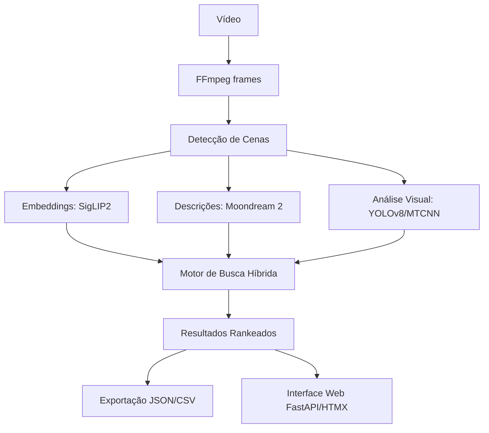

# KUAA - Knowledge from Unstructured Audiovisual Archives

**Offline multimodal search and metadata generation for archival video collections.**

*kuaa* — Guarani for *to know* — is a local-first applied AI workbench designed to transform raw video files into searchable, human-reviewable scene catalogs. Specifically engineered for film archives, it handles the "messy" realities of historical footage: sparse metadata, inconsistent aspect ratios, and degraded signal quality.

[](https://github.com/guto-mojica/kuaa/actions/workflows/ci.yml)
[](LICENSE)
[](https://python.org)
[](CHANGELOG.md)

---

## 🎯 Overview

**Privacy-first, multimodal retrieval for film archives.**  
KUAA allows users to search hours of audiovisual material by visual content and descriptive attributes — without ever sending a single frame to the cloud. By prioritizing local execution, KUAA ensures that sensitive archival data remains on-premises while providing high-quality results through a sophisticated multi-layered pipeline.

### Core Capabilities
The system features a modular retrieval stack where every component runs locally (no API keys required):

*   **Multimodal Search:** Powered by `SigLIP2` for dense image/text embeddings, with fallback support for OpenCLIP.
*   **Hybrid Retrieval:** Combines **BM25** (lexical) over LLM-generated descriptions and tags with **dense scores** via Reciprocal Rank Fusion (RRF).
*   **Visual Discovery:** Implements **kNN** over keyframe embeddings, diversified by **Maximal Marginal Relevance (MMR)** to find "visually similar" scenes across different films.
*   **Smart Reranking:** Includes a `BAAI/bge-reranker-v2-m3` cross-encoder (currently opt-in) to refine results where high precision is required.

### The Technical Stack
| Component | Model / Technology | Role |
| :--- | :--- | :--- |
| **Image Embedding** | `google/siglip2-large-patch16-256` | Multilingual vision-language search |
| **Reranker** | `BAAI/bge-reranker-v2-m3` | Re-ranking for high-precision queries (Opt-in) |
| **Scene Description** | Moondream 2 | Local Vision-Language Model (VLM) |
| **Object Detection** | YOLOv8 | Identifying objects and scene elements |
| **Face Detection** | MTCNN | Facial detection & crowd counting |

### What makes it "Production-Ready"?
*   **Privacy by Design:** Designed for institutional use where data sovereignty is non-negotiable.
*   **Scalable Architecture:** Uses typed `Protocols` to swap model backends easily, and **Domain Packs** to switch between different metadata requirements (e.g., transitioning from "Archive" logic to "Broadcast" logic).
*   **Data provenance:** Every run generates a `run_manifest.json`, tracking the exact configuration and models used for every piece of metadata produced.

### Who is this for?
*   **Archivists & Curators:** To create an initial searchable layer over vast, uncatalogued collections.
*   **Researchers:** To find specific visual moments in long-form documentary footage.
*   **Applied AI Engineers:** A practical look at building a "real" multimodal system with local inference and hybrid search logic.

---

## 🛠 Features & Pipeline

Beyond search, the core pipeline automates the heavy lifting of archival metadata:

1.  **Scene Segmentation:** Automatically detects cuts and extracts representative keyframes.
2.  **Visual Analysis:** Detects faces/objects and classifies environments (e.g., "indoor," "night").
3.  **Natural Language Descriptions:** Moondream 2 generates descriptive text for every scene.
4.  **Manual Overrides:** A dedicated UI allows curators to correct AI-generated tags, merging human expertise with machine scale.
5.  **Structured Export:** Generates clean JSON/CSV files ready for ingestion into existing archival databases.

---

## 🚀 Quick Start

The project is optimized for development and deployment using `uv`.

### Local Installation
```bash
git clone https://github.com/guto-mojica/kuaa.git
cd kuaa
uv venv
uv sync --extra full --group dev
uv run kuaa serve
```
*The app will be accessible at `http://localhost:8501`.*

### Public Demo (Pre-processed)
To explore the system with a pre-built dataset of Library of Congress footage:
```bash
uv run python scripts/prepare_demo.py --download
uv run kuaa serve --config config/demo.yaml
```

---

## 🇧🇷 Versão em Português (Resumo)

*kuaa* — inspirado no termo Guarani para "conhecimento" — é uma ferramenta de código aberto para processar vídeos e gerar automaticamente um catálogo pesquisável com:

- **Segmentação de cenas** & **Análise visual** (rostos, objetos, ambiente).
- **Descrições em linguagem natural** via modelos de visão locais.
- **Busca semântica híbrida** (texto + imagem) sem necessidade de conexão com a internet.

---

## 🏗 Arquitetura e Decisões Técnicas

O sistema é modularizado para facilitar a manutenção e a substituição de componentes:

1.  **Ingestão:** Extração de frames via FFmpeg.
2.  **Processamento:** Pipeline sequencial que gera embeddings (SigLIP) e descrições (Moondream).
3.  **Indexação:** Motor de busca combinando BM25 e buscas densas.
4.  **Interface:** Desenvolvida com FastAPI + HTMX, focada em usabilidade para usuários não-técnicos.

*Diagrama completo a seguir.*



---

## 📋 Modelos e Licenças

| Modelo | Tarefa | Detalhes |
|---|---|---|
| **SigLIP 2** | Embeddings Visuais | Multilíngue, robusto para busca semântica. |
| **Moondream 2** | Descrição de Cenas | Modelo leve e eficiente para descrições em texto. |
| **YOLOv8n** | Objetos | Detecção rápida (Atenção à licença AGPL-3.0). |
| **MTCNN** | Faces | Detecção facial — contagem de presença humana, sem reconhecimento de identidade. |

---

## 🤝 Ferramentas & Créditos
Desenvolvido com o auxílio de **Claude Code** como parceiro de programação, mas com todas as decisões de arquitetura, seleção de modelos e lógica de busca (RRF, MMR, etc.) definidas pelo autor.

*Para mais detalhes sobre o contexto do projeto, veja:* [docs/CASE_STUDY.md](docs/CASE_STUDY.md).

---

## 📄 Licença
MIT — Veja o arquivo [LICENSE](LICENSE) para detalhes. Note que componentes específicos como YOLOv8 possuem licenças próprias (AGPL-3.0).
