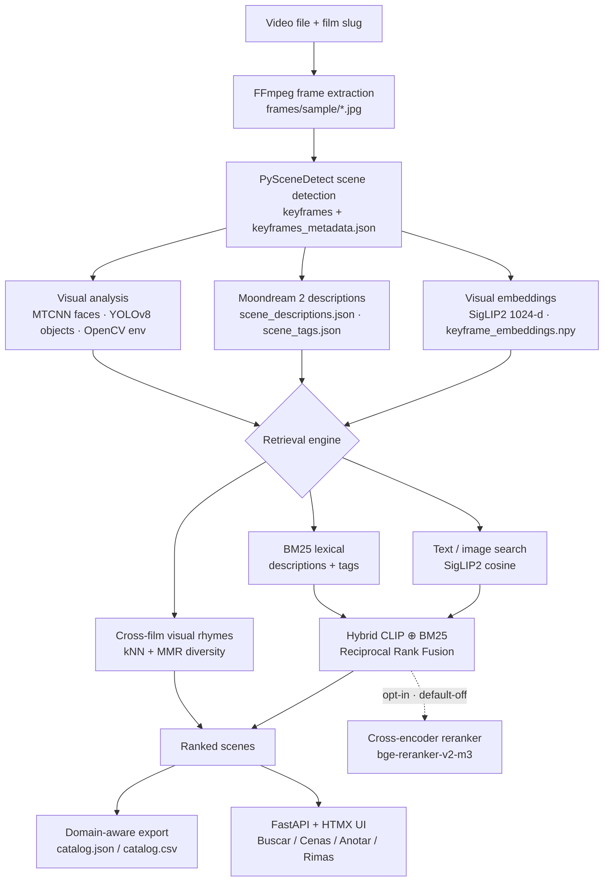

# Architecture

## System overview

KUAA is a local-first video cataloging application. It has two major surfaces:

- a batch pipeline that turns a video into keyframes, metadata, embeddings, and
  descriptions;
- a FastAPI + HTMX web interface for multi-film search, browsing, annotation,
  visual-rhyme discovery, eval grading, exports, and pipeline progress.

The app uses a registry-backed multi-film layout under `data/library/<slug>/...`
while retaining a legacy flat `data/{metadata,frames,embeddings}` context for
older configs.

## High-level flow

```text
Video file + film slug
  |
  |-- FFprobe
  |     -> data/library/<slug>/metadata/video_properties.json
  |
  |-- FFmpeg frame extraction
  |     -> data/library/<slug>/frames/sample/*.jpg
  |
  |-- PySceneDetect scene detection
  |     -> data/library/<slug>/frames/scenes/keyframes_content/*.jpg
  |     -> data/library/<slug>/metadata/keyframes_metadata.json
  |
  |-- Visual analysis
  |     -> face detection
  |     -> object detection
  |     -> environment heuristic
  |     -> data/library/<slug>/metadata/visual_analysis.json
  |
  |-- Visual embeddings
  |     -> data/library/<slug>/embeddings/keyframe_embeddings.npy
  |     -> data/library/<slug>/embeddings/index_mapping.json
  |
  |-- Vision-language descriptions
        -> data/library/<slug>/metadata/scene_descriptions.json
        -> data/library/<slug>/metadata/scene_tags.json
```

### Pipeline and retrieval stack (diagram)



## Pipeline modules

Primary entry points:

- `src/kuaa/pipeline.py`: orchestrates the processing steps.
- `src/kuaa/__main__.py`: CLI entry point (the `kuaa` command).
- `app.py`: legacy FastAPI entrypoint kept for `uv run app.py` back-compat;
  the canonical invocation is `kuaa serve`.

Processing modules:

- `src/kuaa/data_prep.py`: FFprobe video inspection and FFmpeg frame extraction.
- `src/kuaa/scene_detector.py`: scene detection and keyframe extraction.
- `src/kuaa/visual_analyzer.py`: facade that composes injected visual backends.
- `src/kuaa/embeddings.py`: visual embedding generation/search helpers.
- `src/kuaa/annotations/`: manual annotation storage, scene assembly, and
  description persistence.
- `src/kuaa/library/`: registry, scanning, path context, and per-film
  metadata helpers.
- `src/kuaa/search/`: CLIP/SigLIP, BM25, hybrid, aggregate, upload, cache, and
  rerank primitives.
- `src/kuaa/rhymes/`: cross-film visual-rhyme search and enrichment.
- `src/kuaa/eval/`: evaluation datasets, grades, metrics, and paths.
- `src/kuaa/scene_ids.py`: scene-id normalization helpers.

The pipeline step order is defined in `STEP_ORDER`:

```text
frame_extraction -> scene_detection -> visual_analysis -> embeddings -> llm_description
```

Selected-step execution uses a dependency graph in `STEP_DEPS`. Downstream steps
are blocked when required inputs are missing or an in-run prerequisite failed,
which prevents stale metadata from being treated as a successful run.

## Model backend architecture

Model roles are defined as typed Protocols in `src/kuaa/models/base.py`:

- `ImageEmbedder`
- `FaceDetector`
- `ObjectDetector`
- `SceneDescriber`
- `EnvironmentClassifier`

Concrete backends are selected by `src/kuaa/models/registry.py` using the
`models:` section of the config.

Current backend map:

| Role | Config value | Implementation |
|---|---|---|
| Image embeddings | `siglip_multilingual` | `src/kuaa/models/clip/siglip_multilingual.py` |
| Image embeddings alternative | `clip_openclip` | `src/kuaa/models/clip/openclip.py` |
| Face detection | `mtcnn_pytorch` | `src/kuaa/models/face/mtcnn.py` |
| Object detection | `yolov8` | `src/kuaa/models/objects/yolov8.py` |
| Scene description | `moondream_transformers` | `src/kuaa/models/describer/transformers_hf.py` |
| Scene description alternative | `moondream_gguf` | `src/kuaa/models/describer/gguf.py` |
| Environment classification | `opencv_heuristic` | `src/kuaa/models/environment/opencv_heuristic.py` |

The important design choice is that the pipeline asks the registry for model
roles instead of importing concrete model classes directly. That makes future
ONNX, quantized, fine-tuned, or domain-specific backends possible without
rewriting the orchestration layer. See `docs/PROTOCOL_OPTION.md` for the
rationale behind this design.

## Web application

Primary modules:

- `api/server.py`: FastAPI app, static/media mounts, page rendering.
- `api/routes/search.py`: search tab and search endpoints.
- `api/routes/scenes.py`: scenes browsing tab.
- `api/routes/annotate.py`, `api/routes/annotate_tags.py`,
  `api/routes/annotate_description.py`: manual annotation tab.
- `api/routes/processing.py`: processing tab, pipeline start/cancel, SSE stream.
- `api/routes/library.py`: library/sidebar interactions.
- `api/routes/rimas.py`: visual-rhyme tab and fragments.
- `api/routes/eval.py`: admin-gated eval grading UI and JSON APIs.
- `api/routes/export.py`: structured catalog export routes.
- `api/routes/palette.py`: command-palette JSON search.
- `api/routes/about.py`: about page/modal.
- `api/routes/system.py`: health/readiness routes.

Service modules under `api/services/` back these routes: `catalog.py`
(metadata loading, card construction, tag filtering), `search.py` (index
loading/validation, text/image search orchestration), `annotations.py`
(annotation read/write), `chrome_service.py` (topbar/left-pane context),
`scenes_service.py`, `rhymes_service.py`, `eval_service.py`, and
`processing_service.py`/`processing_stats.py`/`processing_render.py`.

Templates and assets:

- `web/templates/base.html`
- `web/templates/partials/*.html`
- `web/static/css/{main,chrome,buscar,cenas,anotar,rimas,proc,polish,about,eval,home,fonts,fx}.css`
- `web/static/js/{htmx.min,htmx-ext-sse,alpine.min,mojica,palette,eval,focus_trap}.js`
- `web/static/fonts/`

The UI is server-rendered. HTMX swaps tab partials into the main page, and
server-sent events update pipeline progress. Direct routes such as `/search` and
HTMX tab routes share context builders so direct navigation and in-app tab
switching stay consistent.

## Processing jobs

The Processing tab uses `api/jobs.py`.

Current policy:

- one global active job at a time,
- jobs run in a worker thread,
- cancellation is cooperative,
- terminal jobs are retained up to a bounded limit,
- SSE emits typed `update`, `done`, `error`, or `cancelled` frames.

This policy matches the current single-machine, local-first tool. It avoids
concurrent writes to model caches, shared logs, and per-film artifact
directories.

## Main artifact contracts

| Artifact | Producer | Consumer |
|---|---|---|
| `data/library/films.json` | library registration | chrome, aggregate search, exports |
| `data/library/<slug>/metadata/video_properties.json` | `VideoInspector` | run manifest, debugging |
| `data/library/<slug>/metadata/keyframes_metadata.json` | `SceneDetector` | visual analysis, embeddings, descriptions, UI |
| `data/library/<slug>/metadata/visual_analysis.json` | `VisualAnalyzer` | scenes UI, exports |
| `data/library/<slug>/embeddings/keyframe_embeddings.npy` | image embedder backend | search, visual rhymes |
| `data/library/<slug>/embeddings/index_mapping.json` | image embedder backend | search, visual rhymes |
| `data/library/<slug>/metadata/scene_descriptions.json` | scene describer backend | scenes/search/annotate UI |
| `data/library/<slug>/metadata/scene_tags.json` | scene describer backend | tag filtering/search |
| `data/library/<slug>/metadata/manual_annotations.json` | annotation service | tag merge, annotate/scenes/search UI |
| `data/metadata/run_manifest.json` | pipeline/web worker | provenance, operations |

## Configuration

Default configuration lives in `config/default.yaml`.

The web app loads `config/local.yaml` if it exists, otherwise the default
config. The CLI accepts an explicit `--config` argument.

Important sections:

- `paths`: local artifact directories.
- `hardware`: CPU/CUDA/MPS selection.
- `frame_extraction`: sampling and resize settings.
- `scene_detection`: detector and threshold settings.
- `visual_analysis`: face/object/environment options.
- `embeddings`: image-embedding model and output filenames.
- `search`: UI gates and defaults for search controls.
- `retrieval`: reranker, hybrid RRF, and visual-rhyme retrieval settings.
- `llm`: Moondream model/revision/checkpoint behavior.
- `models`: backend selection by role.
- `pipeline`: enabled steps and skip/error behavior.

## Current constraints

- Semantic search is a NumPy dot product over local embeddings, not a vector
  database. This is appropriate for small/medium demo collections and keeps the
  dependency surface simple.
- Cross-film aggregate retrieval scans local per-film indices. It is not a
  distributed vector service.
- The cross-encoder reranker is OFF by default — its effect is unmeasured on
  short captions and its text-only design is suspect (see
  `docs/RERANKER_DECISION.md`). `/api/search` keeps the per-request
  `?reranker_enabled=true` override for experiments.
- Run manifests still write to the configured flat metadata directory rather
  than the active film's per-film metadata directory.
- The environment classifier is heuristic, not a trained archive-specific model.
- The default object detector uses Ultralytics YOLOv8, which has AGPL licensing
  implications. See `docs/MODEL_INVENTORY.md`.
- Model downloads happen on first use unless weights are already cached.
- Full video processing can be slow on CPU, especially scene description.

## Future architecture work

The next high-value architecture additions are:

- the reranker fix-or-remove rework (RRF-fuse / VLM-as-judge) per `docs/RERANKER_DECISION.md`,
- per-modality eval slate generation/scoring beyond text-only report runs,
- collaboration/share/import/settings features as explicit future surfaces,
- a `uv`-only reproducible-run path and an optional buildpack-PaaS hosted instance (no in-repo Dockerfile).
